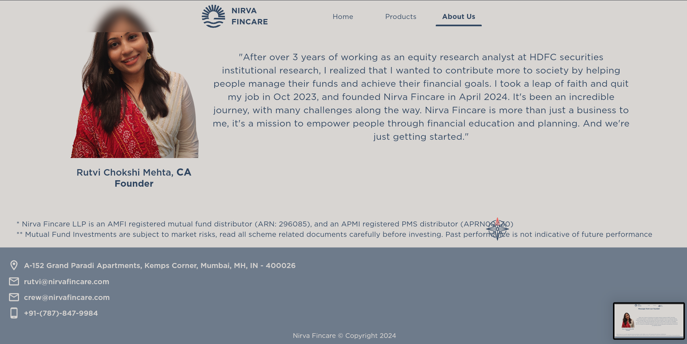

# Nirva Fincare

Welcome to Nirva Fincare, where we empower individuals and families to achieve financial freedom through personalized investment opportunities and comprehensive financial planning.

## Overview

Nirva Fincare aims to provide innovative investment solutions with a focus on trust, integrity, and expertise. Our mission is to create a clear financial plan for each client, ensuring they have the security and peace of mind to pursue their passions and leave a lasting legacy.

## Founder's Message

"At Nirva Fincare, we're dedicated to empowering people through financial education and planning. Our journey began with a vision to contribute more to society by helping individuals manage their funds and achieve their financial goals. We strive to build strong relationships based on trust and integrity, guiding our clients through every stage of their financial journey." - Rutvi Chokshi Mehta, CA

## Disclaimer

**Mutual Fund Investments are subject to market risks. Read all scheme related documents carefully before investing. Past performance is not indicative of future performance.**

## Company Details

- **Registration**: AMFI registered mutual fund distributor (ARN: 296085), and an APMI registered PMS distributor (APRN00430)
- **Address**: A-152 Grand Paradi Apartments, Kemps Corner, Mumbai, MH, IN - 400026
- **Email**: [rutvi@nirvafincare.com](mailto:rutvi@nirvafincare.com), [crew@nirvafincare.com](mailto:crew@nirvafincare.com)
- **Phone**: [+91-(787)-847-9984](tel:+917878479984)

## Products

### Mutual Funds

Mutual funds are professionally managed investment schemes that pool money from multiple investors and invest it in a diversified portfolio of stocks, bonds, and other securities.

### Portfolio Management Services (PMS)

PMS are professional investment management solutions that create and manage customized equity portfolios for high-net-worth individuals and institutions.

### Alternative Investment Funds (AIFs)

AIFs are privately pooled investment vehicles that invest in alternative asset classes such as private equity, venture capital, hedge funds, and real estate.

### Fixed Income Products (FIPs)

FIPs provide a steady stream of income with relatively lower risk compared to other investment options, designed to preserve capital and offer predictable returns.

## Contact Us

For more information about Nirva Fincare, visit our [website](https://nirvafincare.com) or contact us at [rutvi@nirvafincare.com](mailto:rutvi@nirvafincare.com).

## Screenshots

### Desktop

### Mobile

